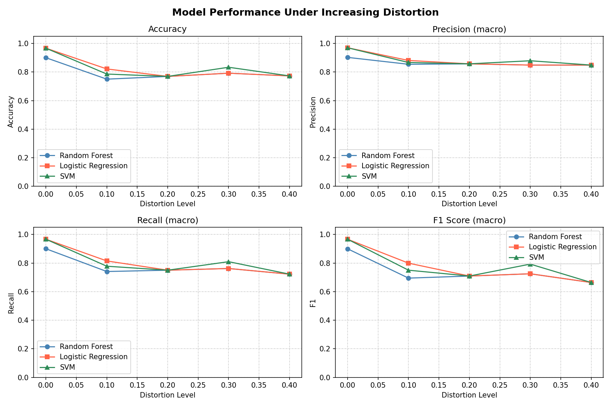
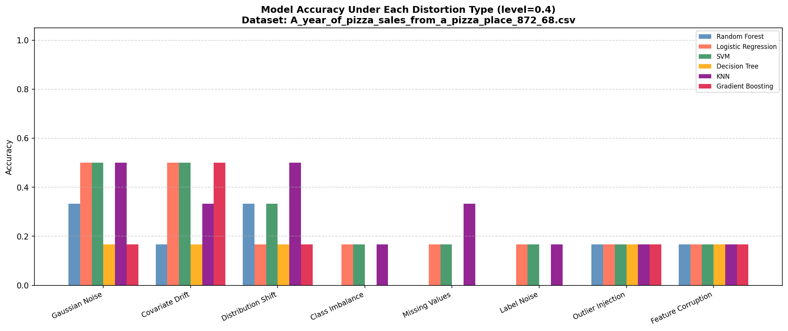
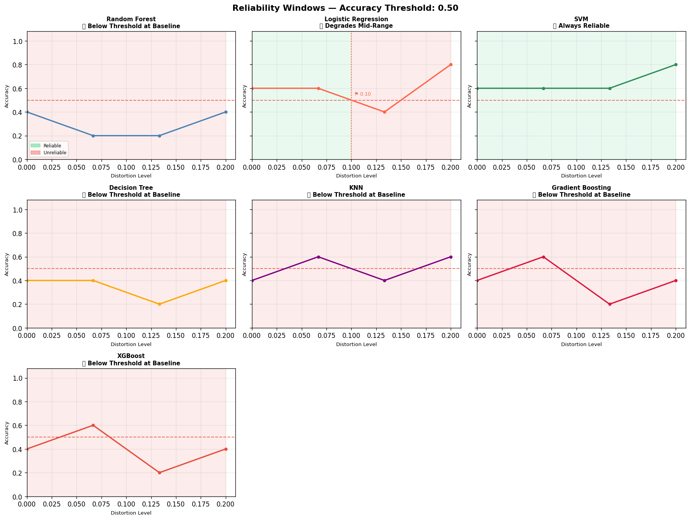

# 🤖 AI Model Performance Simulator

Simulate how ML classification models degrade under real-world data distortions — noise, drift, imbalance, missing values, label noise, outliers, feature corruption, and more.

## 📊 Main Simulation Chart



## 🔬 Per-Distortion Analysis Chart



## ⏱️ Reliability Horizon Chart



---

## What it does

Trains up to **7 ML models** on clean data, then evaluates them across increasing distortion levels. Tracks **6 metrics** at each level, produces a **2×3 comparison chart**, runs a **per-distortion analysis** showing which distortion type hurts each model the most, and computes a **reliability horizon** — the exact distortion level at which each model becomes untrustworthy. Every run is saved locally with charts, metrics, and reliability data.

---

## Models

| Model | Details |
|---|---|
| Random Forest | 100 estimators |
| Logistic Regression | max_iter=2000 |
| SVM | RBF kernel, probability=True |
| Decision Tree | Default sklearn |
| KNN | 5 neighbors |
| Gradient Boosting | 100 estimators |
| XGBoost | 100 estimators, mlogloss eval metric |

---

## Metrics Tracked

| Metric | Description |
|---|---|
| Accuracy | Overall correct predictions |
| Precision (macro) | Avg precision across all classes |
| Recall (macro) | Avg recall across all classes |
| F1 Score (macro) | Harmonic mean of precision & recall |
| ROC-AUC Score | Discrimination ability across classes |
| Model Confidence | Mean max prediction probability |

---

## Distortion Types

| Type | Description |
|---|---|
| Gaussian Noise | Random noise added to all features |
| Covariate Drift | Mean shift in feature values |
| Distribution Shift | Feature variance expansion/compression |
| Class Imbalance | Minority classes progressively dropped |
| Missing Values | Random NaN injection, filled with column mean |
| Label Noise | Random class label flipping (annotation errors) |
| Outlier Injection | Extreme values (±5 std devs) in random samples |
| Feature Corruption | Random feature columns zeroed out (sensor failure) |

---

## Dataset Support

- **Built-in:** Iris, Wine, Breast Cancer (sklearn)
- **Custom CSV:** Upload any CSV file
  - Auto-detects numeric features
  - Auto-encodes categorical columns (up to 20 unique values)
  - Drops ID-like and high-cardinality columns
  - Handles missing values, duplicates, and class imbalance warnings
  - Detects and warns about regression targets

---

## Simulation Controls

| Control | Description |
|---|---|
| Max Distortion Level | How severe distortions get (0.1 mild → 1.0 extreme) |
| Number of Distortion Levels | Steps between 0 and max level |
| Test Set Size | Fraction of data held out for testing |
| Feature Scaling | StandardScaler on/off |
| Random Seed | Reproducible train/test splits |
| Model Selection | Choose which models to compare |
| Distortion Type Checkboxes | Choose which distortions to apply |

---

## ⏱️ Model Reliability Horizon

Answers the key question: **"At what distortion level does this model become untrustworthy?"**

### How it works

1. You set a **reliability threshold** (e.g. accuracy ≥ 0.75) via an interactive slider
2. The simulator scans each model's performance curve across distortion levels
3. It **interpolates the exact crossing point** between the last good level and the first bad level — the **reliability horizon**
4. Models that never drop below the threshold are marked **Always Reliable**

### Auto-threshold

The threshold is **auto-suggested at 80% of the best model's clean baseline accuracy** — so it always produces meaningful results regardless of how hard or easy the dataset is. For a dataset where the best model scores 0.55, the threshold is auto-set to 0.44 rather than defaulting to 0.75 (which would mark everything as "Below Threshold at Baseline").

### Robustness tiers

| Reliable Range % | Tier |
|---|---|
| 90–100% | Always Reliable |
| 60–89% | Degrades Mid-Range |
| 0–59% | Degrades Early / Below Threshold at Baseline |

### Outputs

- **Per-model subplots** — green shaded (safe zone) and red shaded (unreliable zone) with a threshold line and horizon marker flag
- **Colour-coded Reliability Horizon Table** — Reliable Range % highlighted green/yellow/red
- **Auto-generated verdict** — viva-ready conclusion paragraph summarising most/least reliable models
- **Metric selector** — switch between accuracy, F1, precision, recall; chart and table update instantly without re-running the simulation
- **CSV download** — reliability horizon table exportable for reports

### Persistent widget state

Changing the threshold slider or metric dropdown **does not re-run the simulation** — it recomputes the horizon from cached results and re-renders the chart instantly. The per-distortion chart metric selector works the same way.

---

## Run History

Every simulation run is automatically saved to `results/run_NNN/`:

```
results/
├── run_001/
│   ├── run_001.json                 # Settings, metrics, timestamps, reliability data
│   ├── results.png                  # Main 2×3 simulation chart
│   ├── per_distortion.png           # Per-distortion bar chart
│   ├── reliability.png              # Reliability horizon chart
│   ├── per_distortion_analysis.csv  # Per-distortion results table
│   └── reliability_horizons.csv     # Reliability horizon table
├── run_002/
│   └── ...
```

The **Run History** section in the Streamlit dashboard shows all past runs with:
- Main simulation chart image
- Per-distortion chart image
- Reliability horizon chart image
- Reliability settings used (metric + threshold)
- Reliability horizon table with most/least reliable model summary cards
- Full simulation results table

### JSON structure

Each `run_NNN.json` stores:

```json
{
  "run_id": 1,
  "timestamp": "2026-05-01 14:32:00",
  "dataset": "iris",
  "settings": { "max_distortion_level": 0.4, "num_levels": 5, "...": "..." },
  "distortions_used": { "gaussian_noise": true, "...": "..." },
  "levels": [0.0, 0.1, 0.2, 0.3, 0.4],
  "results": {
    "random_forest": [{ "accuracy": 0.95, "f1": 0.94, "...": "..." }],
    "logistic_regression": ["..."],
    "svm": ["..."]
  },
  "reliability": {
    "threshold": 0.75,
    "metric": "accuracy",
    "horizons": [
      {
        "Model": "Random Forest",
        "Baseline": 0.95,
        "Horizon Level": 0.38,
        "Reliable Range (%)": 95.0,
        "Status": "Always Reliable",
        "Rank": 1
      }
    ]
  }
}
```

---

## Setup

```bash
git clone https://github.com/n-a-n-d-a-n/AI-Model-Performance-Simulator.git
cd AI-Model-Performance-Simulator
pip install -r requirements.txt
```

---

## Usage

**Web Dashboard (Streamlit):**

```bash
streamlit run app.py
```

**CLI (terminal):**

```bash
# Default (Iris dataset)
python main.py

# Different dataset
python main.py --dataset wine
python main.py --dataset breast_cancer

# Custom distortion levels
python main.py --levels 0 0.05 0.1 0.2 0.3 0.5

# Custom CSV
python main.py --csv path/to/your/data.csv

# Save plot
python main.py --save output/results.png
```

---

## Run Tests

```bash
pytest test_simulator.py -v
```

All 7 tests pass.

---

## Project Structure

```
AI-Model-Performance-Simulator/
├── app.py                    # Streamlit web dashboard
├── main.py                   # CLI entry point
├── model.py                  # 7 models + dataset loading + colors/markers
├── distortions.py            # 8 distortion functions
├── distortion_analysis.py    # Per-distortion analysis engine
├── evaluation.py             # 6 metrics — accuracy, precision, recall, F1, ROC-AUC, confidence
├── visualization.py          # 2×3 metrics chart
├── reliability_analysis.py   # Reliability horizon tracker
├── run_logger.py             # Run history — save + load (JSON + PNG + CSV)
├── test_simulator.py         # Unit tests (7/7 passing)
├── requirements.txt
├── .gitignore
└── results/                  # Saved run folders (git-ignored)
    └── run_NNN/
        ├── run_NNN.json
        ├── results.png
        ├── per_distortion.png
        ├── reliability.png
        ├── per_distortion_analysis.csv
        └── reliability_horizons.csv
```

---

## Requirements

```
numpy
pandas
scikit-learn
matplotlib
streamlit
xgboost
```

---

## Key Design Decisions

**Why session state for charts?**
Streamlit reruns the entire script on every widget interaction. Without `st.session_state`, changing the metric dropdown or reliability threshold would clear all simulation results and show a blank screen. All simulation outputs are stored in session state after a run, so sliders and dropdowns update charts instantly without re-training models.

**Why auto-suggest the reliability threshold?**
A fixed default of 0.75 fails on hard datasets where even the best model scores 0.50 at baseline — every model would be marked "Below Threshold at Baseline" and the analysis would be meaningless. Auto-suggesting 80% of the best baseline makes the threshold dataset-aware.

**Why interpolate the horizon?**
A coarse distortion grid (e.g. 5 levels from 0 to 0.4) means a model might be fine at 0.3 and fail at 0.4, but the true crossing point is somewhere between. Linear interpolation gives a more precise horizon level instead of just reporting the last known good level.

**Why XGBoost?**
XGBoost consistently outperforms standard Gradient Boosting on tabular data due to regularisation, parallelised tree building, and better handling of sparse features. It serves as a strong baseline for comparing ensemble robustness under distortion.