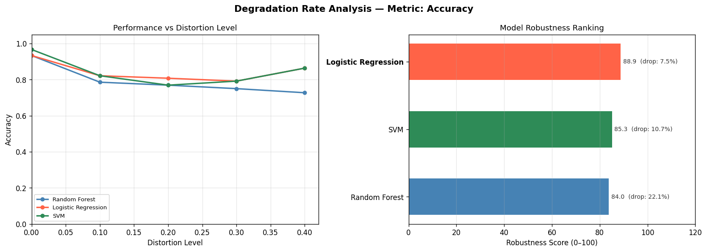
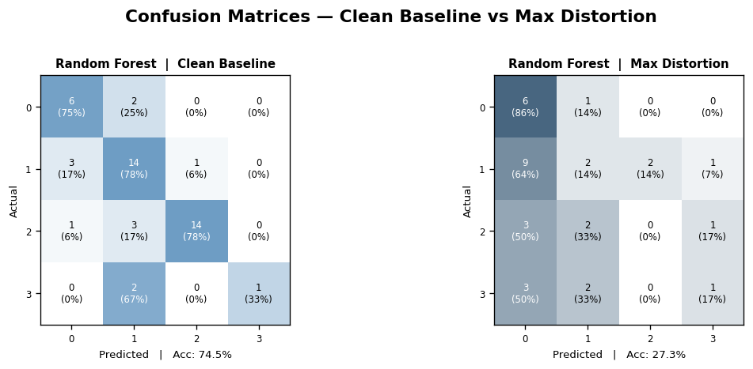
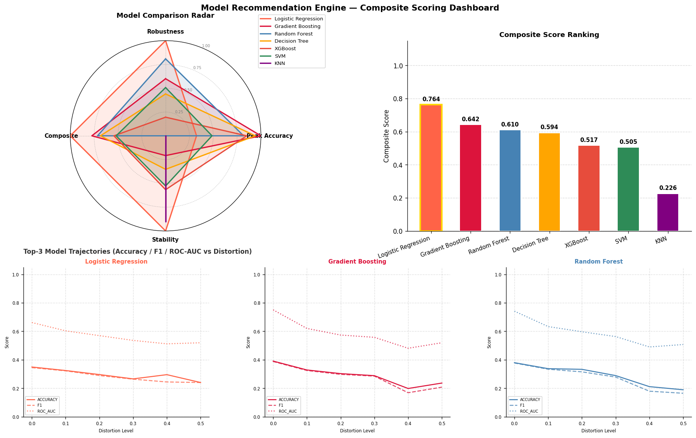

# 🤖 AI Model Performance Simulator

Simulate how ML classification models degrade under real-world data distortions — noise, drift, imbalance, missing values, label noise, outliers, feature corruption, and more.

## 📊 Main Simulation Chart


## 🔬 Per-Distortion Analysis Chart


## 📉 Degradation Rate Analysis



## 🔲 Confusion Matrices — Clean vs Max Distortion



## ⏱️ Reliability Horizon Chart


## 🧠 Intelligent Model Recommendation Engine



Automatically recommends the **best ML model** for deployment based on robustness, reliability, degradation behaviour, and overall stability under distortions.

The recommendation engine combines multiple analysis metrics into a unified scoring framework to identify the most production-ready model.

### Recommendation Factors

| Factor | Description |
|---|---|
| Robustness Score | Area-under-curve based stability across distortion levels |
| Reliability Horizon | Distortion tolerance before model becomes unreliable |
| Accuracy Retention | How much clean performance is preserved |
| Degradation Rate | Speed of performance collapse under distortions |
| Confidence Stability | Consistency of prediction confidence |
| Distortion Resilience | Ability to withstand multiple distortion types |

### Dashboard Outputs

- **Overall Best Model Banner** — recommended deployment-ready model
- **Weighted Ranking Table** — all models ranked by combined score
- **Comparative Analysis Charts** — multi-factor robustness comparison
- **Strengths & Weaknesses Summary** — automatic interpretation of each model
- **Deployment Verdict** — identifies safest production candidate
- **CSV Export** — downloadable recommendation analysis

### Recommendation Logic

The engine evaluates every model using weighted scoring across:
- robustness,
- reliability,
- degradation stability,
- confidence preservation,
- and distortion resilience.

Models that:
- degrade slowly,
- remain reliable longer,
- preserve confidence,
- and maintain balanced performance

receive higher recommendation scores.

This creates a more realistic deployment recommendation than accuracy alone.

---

## What it does

Trains up to **7 ML models** on clean data, then evaluates them across increasing distortion levels. Tracks **6 metrics** at each level and produces:

- A **2×3 comparison chart** of all metrics vs distortion level
- A **per-distortion analysis** showing which distortion type hurts each model the most
- A **degradation rate analysis** showing how fast each model degrades, with robustness scores and tier badges
- **Confusion matrices** comparing each model's clean vs max-distortion classification behaviour
- A **reliability horizon** — the exact distortion level at which each model becomes untrustworthy

Every run is saved locally with charts, metrics, and all analysis data.

---

## Models

| Model | Details |
|---|---|
| Random Forest | 100 estimators |
| Logistic Regression | max_iter=2000 |
| SVM | RBF kernel, probability=True |
| Decision Tree | Default sklearn |
| KNN | 5 neighbors |
| Gradient Boosting | 100 estimators |
| XGBoost | 100 estimators, mlogloss eval metric |

---

## Metrics Tracked

| Metric | Description |
|---|---|
| Accuracy | Overall correct predictions |
| Precision (macro) | Avg precision across all classes |
| Recall (macro) | Avg recall across all classes |
| F1 Score (macro) | Harmonic mean of precision & recall |
| ROC-AUC Score | Discrimination ability across classes |
| Model Confidence | Mean max prediction probability |

---

## Distortion Types

| Type | Description |
|---|---|
| Gaussian Noise | Random noise added to all features |
| Covariate Drift | Mean shift in feature values |
| Distribution Shift | Feature variance expansion/compression |
| Class Imbalance | Minority classes progressively dropped |
| Missing Values | Random NaN injection, filled with column mean |
| Label Noise | Random class label flipping (annotation errors) |
| Outlier Injection | Extreme values (±5 std devs) in random samples |
| Feature Corruption | Random feature columns zeroed out (sensor failure) |

---

## Dataset Support

- **Built-in:** Iris, Wine, Breast Cancer (sklearn)
- **Custom CSV:** Upload any CSV file
  - Auto-detects numeric features
  - Auto-encodes categorical columns (up to 20 unique values)
  - Drops ID-like and high-cardinality columns
  - Handles missing values, duplicates, and class imbalance warnings
  - Detects and warns about regression targets

---

## Simulation Controls

| Control | Description |
|---|---|
| Max Distortion Level | How severe distortions get (0.1 mild → 1.0 extreme) |
| Number of Distortion Levels | Steps between 0 and max level |
| Test Set Size | Fraction of data held out for testing |
| Feature Scaling | StandardScaler on/off |
| Random Seed | Reproducible train/test splits |
| Model Selection | Choose which models to compare |
| Distortion Type Checkboxes | Choose which distortions to apply |

---

## 📉 Degradation Rate Analysis

Shows how fast each model degrades as distortion increases.

### Metrics computed per model

| Metric | Description |
|---|---|
| Baseline | Performance at zero distortion (clean data) |
| Worst | Performance at maximum distortion level |
| Abs Drop | Baseline minus Worst |
| % Drop | Percentage of baseline performance lost |
| Deg Rate/Level | Performance lost per unit of distortion |
| Robustness Score | Area under performance curve, normalised 0–100 |

### Robustness tiers

| Score | Tier |
|---|---|
| 90–100 | Excellent |
| 75–89 | Good |
| 55–74 | Moderate |
| 0–54 | Fragile |

### Outputs

- **Two-panel chart** — left: performance curves per model; right: horizontal robustness ranking bar chart with % drop annotations
- **Colour-coded summary table** — green/yellow/orange/red by robustness score
- **Tier badges** — `st.metric` cards showing each model's tier and % drop
- **Metric selector** — switch between accuracy, F1, precision, recall without re-running
- **CSV download** — degradation summary exportable

---

## 🔲 Confusion Matrices

Shows each model's confusion matrix at **clean baseline** (left) and **max distortion** (right) side by side.

### What it shows

- Each cell displays raw count and row-normalised percentage
- Diagonal cells = correct predictions; off-diagonal = misclassifications
- Accuracy shown below each matrix
- Color intensity reflects prediction rate per cell
- Accuracy summary `st.metric` cards below the chart show clean accuracy and drop at max distortion per model

---

## ⏱️ Model Reliability Horizon

Answers the key question: **"At what distortion level does this model become untrustworthy?"**

### How it works

1. You set a **reliability threshold** (e.g. accuracy ≥ 0.75) via an interactive slider
2. The simulator scans each model's performance curve across distortion levels
3. It **interpolates the exact crossing point** between the last good level and the first bad level — the **reliability horizon**
4. Models that never drop below the threshold are marked **Always Reliable**

### Auto-threshold

The threshold is **auto-suggested at 80% of the best model's clean baseline accuracy** — so it always produces meaningful results regardless of how hard or easy the dataset is.

### Robustness tiers

| Reliable Range % | Tier |
|---|---|
| 90–100% | Always Reliable |
| 60–89% | Degrades Mid-Range |
| 0–59% | Degrades Early / Below Threshold at Baseline |

### Outputs

- **Per-model subplots** — green shaded (safe zone) and red shaded (unreliable zone) with threshold line and horizon marker
- **Best model banner** — green success box showing the recommended model
- **Colour-coded Reliability Horizon Table** — Reliable Range % highlighted green/yellow/red
- **Auto-generated verdict** — viva-ready conclusion paragraph
- **Metric selector** — switch between accuracy, F1, precision, recall without re-running
- **CSV download** — reliability horizon table exportable

### Persistent widget state

Changing any slider or dropdown **does not re-run the simulation** — all sections recompute from cached results instantly.

---

## Run History

Every simulation run is automatically saved to `results/run_NNN/`:

```
results/
├── run_001/
│   ├── run_001.json                 # Settings, metrics, reliability + degradation data
│   ├── results.png                  # Main 2×3 simulation chart
│   ├── per_distortion.png           # Per-distortion bar chart
│   ├── degradation_analysis.png     # Degradation rate + robustness ranking
│   ├── confusion_matrices.png       # Clean vs max distortion confusion matrices
│   ├── reliability.png              # Reliability horizon chart
│   ├── per_distortion_analysis.csv  # Per-distortion results table
│   ├── degradation_summary.csv      # Robustness scores per model
│   └── reliability_horizons.csv     # Reliability horizon table
├── run_002/
│   └── ...
```

The **Run History** section in the Streamlit dashboard shows all past runs with all charts and tables inline.

### JSON structure

Each `run_NNN.json` stores:

```json
{
  "run_id": 1,
  "timestamp": "2026-05-01 14:32:00",
  "dataset": "iris",
  "settings": { "max_distortion_level": 0.4, "num_levels": 5, "...": "..." },
  "distortions_used": { "gaussian_noise": true, "...": "..." },
  "levels": [0.0, 0.1, 0.2, 0.3, 0.4],
  "results": {
    "random_forest": [{ "accuracy": 0.95, "f1": 0.94, "...": "..." }],
    "logistic_regression": ["..."],
    "svm": ["..."]
  },
  "degradation": [
    {
      "Rank": 1, "Model": "Random Forest",
      "Baseline": 0.95, "Worst": 0.81,
      "Abs Drop": 0.14, "% Drop": 14.7,
      "Deg Rate/Level": 0.35, "Robustness Score": 91.2
    }
  ],
  "reliability": {
    "threshold": 0.75,
    "metric": "accuracy",
    "horizons": [
      {
        "Model": "Random Forest", "Baseline": 0.95,
        "Horizon Level": 0.38, "Reliable Range (%)": 95.0,
        "Status": "Always Reliable", "Rank": 1
      }
    ]
  },
  "_png_path": "results/run_001/results.png",
  "_analysis_png_path": "results/run_001/per_distortion.png",
  "_degradation_png_path": "results/run_001/degradation_analysis.png",
  "_confusion_png_path": "results/run_001/confusion_matrices.png",
  "_reliability_png_path": "results/run_001/reliability.png"
}
```

---

## Setup

```bash
git clone https://github.com/n-a-n-d-a-n/AI-Model-Performance-Simulator.git
cd AI-Model-Performance-Simulator
pip install -r requirements.txt
```

---

## Usage

**Web Dashboard (Streamlit):**

```bash
streamlit run app.py
```

**CLI (terminal):**

```bash
# Default (Iris dataset)
python main.py

# Different dataset
python main.py --dataset wine
python main.py --dataset breast_cancer

# Custom distortion levels
python main.py --levels 0 0.05 0.1 0.2 0.3 0.5

# Custom CSV
python main.py --csv path/to/your/data.csv

# Save plot
python main.py --save output/results.png
```

---

## Run Tests

```bash
pytest test_simulator.py -v
```

All 7 tests pass.

---

## Project Structure

```
AI-Model-Performance-Simulator/
├── app.py                         # Streamlit web dashboard
├── main.py                        # CLI entry point
├── model.py                       # 7 models + dataset loading + colors/markers
├── distortions.py                 # 8 distortion functions
├── distortion_analysis.py         # Per-distortion analysis engine
├── evaluation.py                  # 6 metrics
├── visualization.py               # 2×3 metrics chart
├── degradation_analysis.py        # Degradation rate + robustness scoring
├── confusion_matrix_analysis.py   # Clean vs max distortion confusion matrices
├── reliability_analysis.py        # Reliability horizon tracker
├── run_logger.py                  # Run history — save + load (JSON + PNG + CSV)
├── test_simulator.py              # Unit tests (7/7 passing)
├── requirements.txt
├── .gitignore
└── results/                       # Saved run folders (git-ignored)
    └── run_NNN/
        ├── run_NNN.json
        ├── results.png
        ├── per_distortion.png
        ├── degradation_analysis.png
        ├── confusion_matrices.png
        ├── reliability.png
        ├── per_distortion_analysis.csv
        ├── degradation_summary.csv
        └── reliability_horizons.csv
```

---

## Requirements

```
numpy
pandas
scikit-learn
matplotlib
streamlit
xgboost
```

---

## Key Design Decisions

**Why session state for charts?**
Streamlit reruns the entire script on every widget interaction. Without `st.session_state`, changing any dropdown or slider would clear all simulation results. All outputs are stored in session state so widgets update charts instantly without re-training.

**Why auto-suggest the reliability threshold?**
A fixed default of 0.75 fails on hard datasets where even the best model scores 0.50 at baseline. Auto-suggesting 80% of the best baseline makes the threshold always meaningful and dataset-aware.

**Why interpolate the horizon?**
A coarse distortion grid means the true crossing point is between two measured levels. Linear interpolation gives a precise horizon level rather than just reporting the last known good level.

**Why XGBoost?**
XGBoost consistently outperforms standard Gradient Boosting on tabular data due to regularisation and parallelised tree building. It serves as a strong ensemble baseline for robustness comparison.

**Why area under the curve for robustness score?**
A model that degrades slowly across many levels is more robust than one that holds well until suddenly collapsing. AUC captures the entire degradation trajectory, not just the endpoint, making it a fairer robustness measure than % drop alone.

**Why confusion matrices at max distortion only?**
Showing every distortion level would produce too many matrices to be readable. Clean baseline vs max distortion gives the clearest before/after picture of how class boundaries collapse under stress.
